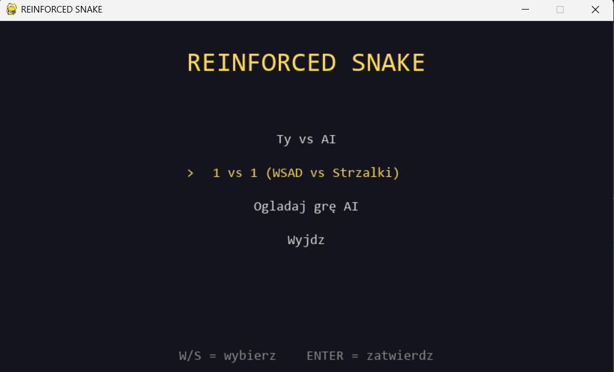
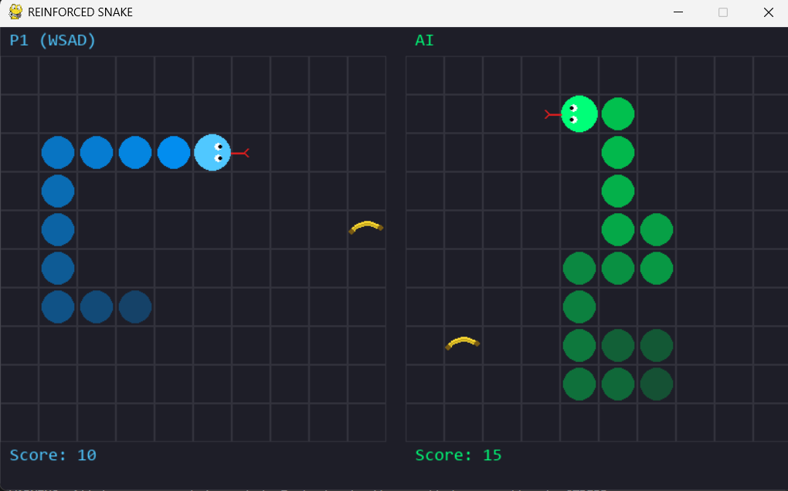
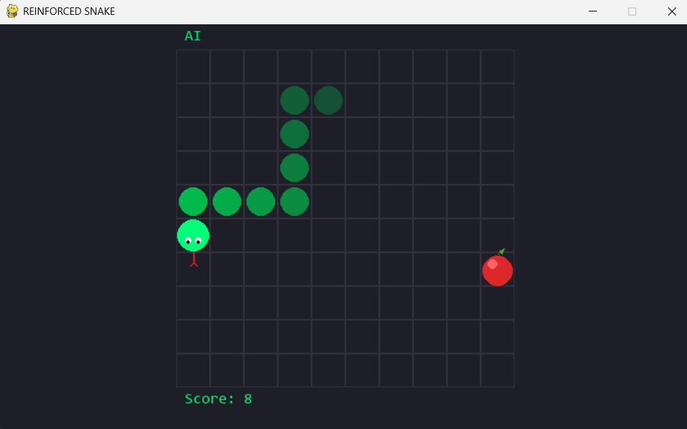
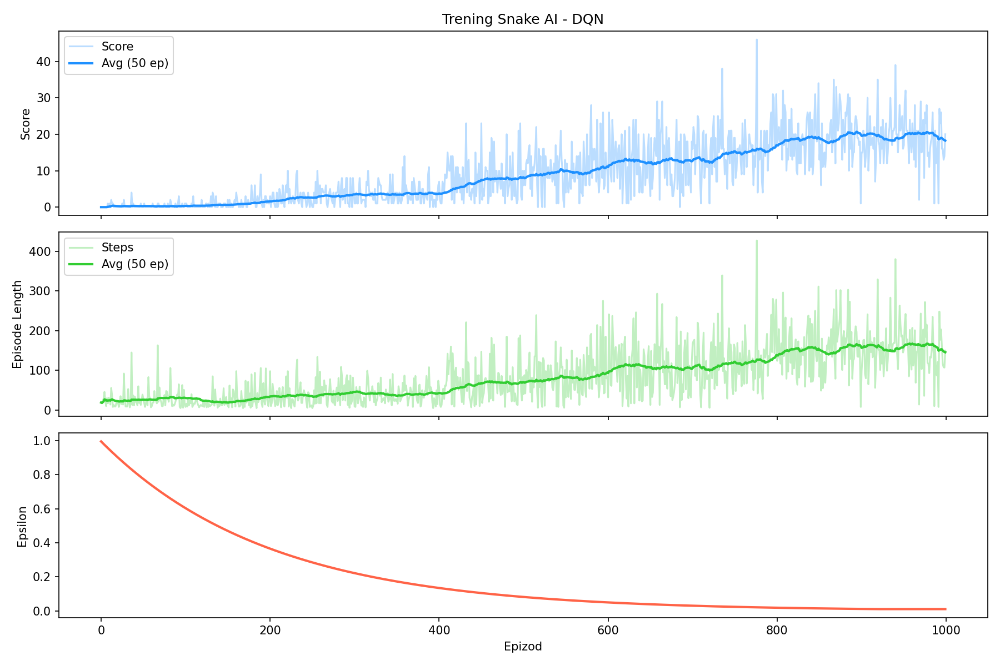
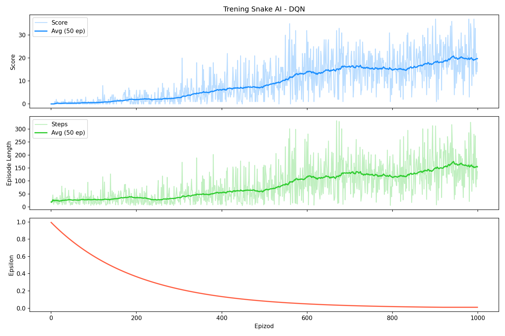
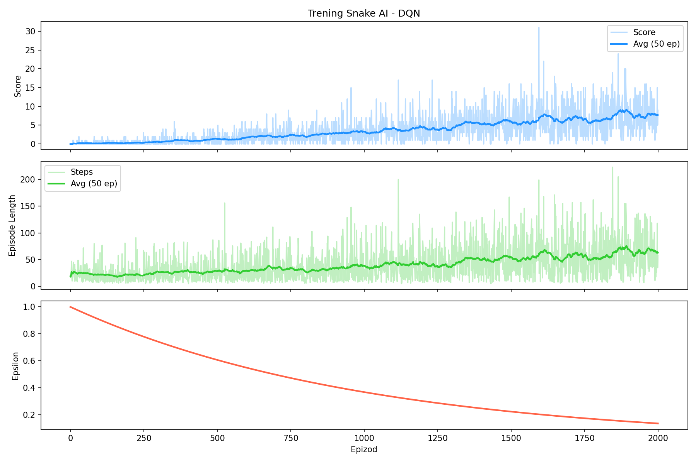
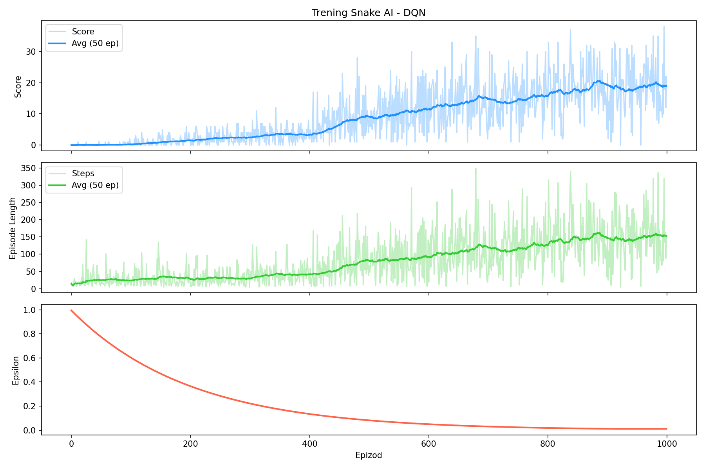
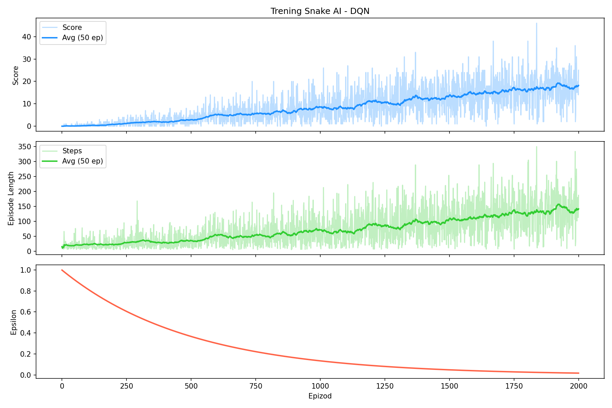

# Reinforced Snake

Snake AI that learns to play using Deep Q-Network (DQN) with TensorFlow. Includes a Pygame application with human vs AI mode, 1v1 local multiplayer, and AI spectating.





---

## About the Project

This project implements a Snake game environment and trains an AI agent to play it using reinforcement learning. The agent uses a DQN (Deep Q-Network) algorithm — the same approach DeepMind used to play Atari games.

The agent observes 16 features describing the game state (dangers, direction, food location, distances) and chooses one of 3 relative actions (straight, turn right, turn left). Through thousands of episodes of trial and error, it learns to navigate toward food while avoiding walls and its own body.

### Game Modes

- **Human vs AI** — play against the trained model using WASD
- **1 vs 1** — local multiplayer (WASD vs Arrow keys)
- **Watch AI** — spectate the trained agent playing autonomously

### Tech Stack

- **Python 3.12** — core language
- **TensorFlow / Keras** — neural network and training
- **Pygame** — game visualization and UI
- **Matplotlib** — training analysis plots
- **Pytest** — test suite

---

## Project Structure

```
Reinforced-snake/
├── model/
│   ├── game.py          # Snake game environment (state, rewards, collisions)
│   ├── agent.py         # DQN agent (network, replay buffer, target network)
│   └── __init__.py
├── app/
│   ├── versus.py        # Pygame app (menu, versus, 1v1, spectate)
│   └── __init__.py
├── tests/
│   ├── test_game.py     # Unit tests for game logic
│   └── test_agent.py    # Unit + integration tests for agent
├── train.py             # Training loop
├── plot.py              # Training visualization
├── requirements.txt
├── .gitignore
└── README.md
```

### Architecture

```
game.py (environment)          agent.py (brain)
┌──────────────────┐          ┌──────────────────────┐
│ reset() → state  │          │ act(state) → action   │
│ step(action)     │◄────────►│ remember(experience)  │
│   → state,       │          │ replay(batch)         │
│     reward,      │          │ update_target_model() │
│     done         │          │                       │
│ get_state() →16  │          │ model: 16→128→128→3   │
└──────────────────┘          │ target_model (frozen) │
                              └──────────────────────┘
         ▲                              ▲
         │         train.py             │
         └──────── (connects both) ─────┘
```

---

## How the AI Works

### State Representation (16 features)

The network sees the game through 16 numbers, not raw pixels. This is a deliberate design choice — hand-crafted features train 10–100x faster than pixel input on a small board.

| Index | Feature | Type | Description |
|-------|---------|------|-------------|
| 0–2 | Danger | Binary | Is there a wall/body ahead, right, left (relative to snake) |
| 3–6 | Direction | One-hot | Which way the snake faces (left, right, up, down) |
| 7–10 | Food direction | Binary | Is food to the left, right, above, below |
| 11–12 | Food distance | Float [-1,1] | Normalized dx, dy to food |
| 13–15 | Wall distance | Float [0,1] | Normalized distance to wall ahead, right, left |

Features 0–2 use **relative directions** (ahead/right/left of snake, not absolute north/south). This means the network doesn't need to learn separate behaviors for "wall to the north when heading north" vs "wall to the east when heading east" — both look identical as "danger ahead = 1".

### DQN Algorithm

The agent uses Deep Q-Network with three key components:

**Q-Network** — A neural network that takes 16 features and outputs 3 Q-values (one per action). The action with the highest Q-value is selected. Architecture: `16 → 128 → 128 → 128 → 3` with ReLU activation.

**Experience Replay** — Instead of learning from sequential steps (which are correlated), the agent stores experiences in a buffer (100k capacity) and learns from random batches of 32. This breaks correlation and stabilizes training.

**Target Network** — A frozen copy of the Q-network, updated every 100 episodes. Without it, the network "chases its own tail" — Q-values it learns from change with every training step, causing instability. The target network provides a stable reference point.

### Reward System

| Event | Reward | Purpose |
|-------|--------|---------|
| Eat food | +10 | Encourage seeking food |
| Die (wall/body/starvation) | -10 | Punish mistakes |
| Move toward food | +1 | Guide exploration |
| Move away from food | -1 | Discourage aimless wandering |

The directional micro-rewards (+1/-1) provide feedback **every step** instead of only when eating or dying. This dramatically accelerates learning — the agent gets 50x more training signal per episode.

### Training Process

```
Episode loop (1000 episodes):
  1. Reset game
  2. Agent observes state (16 features)
  3. Agent chooses action (epsilon-greedy: random early, learned later)
  4. Game returns new state, reward, done
  5. Agent stores experience in replay buffer
  6. Every 4 steps: agent learns from random batch of 32 experiences
  7. Every 100 episodes: update target network weights
  8. After episode: decay epsilon (1.0 → 0.01 over ~920 episodes)
```

---

## Training Results

### Base Configuration

| Parameter | Value |
|-----------|-------|
| gamma     | 0.9 |
| epsilon_decay | 0.995 |
| architecture | 128 → 128 → 128 → 3 |
| batch_size | 32 |
| replay every | 4 steps |
| target update | every 100 episodes |
| episodes | 1000 |

**Best score: ~45 | Average (last 100 ep): ~18**



The training curve shows two distinct phases: first the agent learns to survive (episode length increases), then it learns to seek food efficiently (score increases). Score begins rising meaningfully around episode 300–400, coinciding with epsilon dropping below 0.5.

### Hyperparameter Experiments

All experiments change **one parameter** from the base configuration to isolate its effect.

#### Experiment 1: gamma 0.99 (higher discount factor)

**Hypothesis:** Higher gamma means the agent values future rewards more, leading to better long-term planning.

**Change:** `gamma: 0.9 → 0.99`



**Result: No improvement.** Average score ~18, best ~38 — virtually identical to baseline. On a 10×10 board, food is usually 5–10 steps away. Gamma 0.9 already values a reward 10 steps out at 35% — sufficient for this scale. Gamma 0.99 would matter on a 50×50 board where planning 50+ steps ahead is necessary.

**Conclusion:** Gamma 0.9 is optimal for small boards. Higher gamma adds no benefit and can slow convergence.

---

#### Experiment 2: epsilon_decay 0.999 (slower exploration)

**Hypothesis:** Slower epsilon decay means longer exploration, potentially discovering better strategies.

**Change:** `epsilon_decay: 0.995 → 0.999`, `episodes: 1000 → 2000`



**Result: Significantly worse.** Average score ~7, best ~30. After 2000 episodes, epsilon is still ~0.1 — the agent is **still exploring** when it should be exploiting. Episode length plateaus at ~60 (vs ~150 for baseline).

**Conclusion:** Epsilon decay 0.999 is far too slow. The agent wastes thousands of episodes making random moves instead of using what it learned. With decay 0.995, epsilon reaches minimum around episode 920 — leaving ~80 episodes of pure exploitation. With 0.999, it would need ~4600 episodes. **This is the most impactful hyperparameter to get wrong.**

---

#### Experiment 3: Smaller Network (64 → 32)

**Hypothesis:** Smaller network trains faster but has a lower performance ceiling.

**Change:** Architecture: `128→128→128→3` → `128→64→32→3`



**Result: Identical performance.** Average score ~18, best ~38. Episode length ~150. The smaller network achieves the same results with ~4x fewer parameters.

**Conclusion:** 16 hand-crafted features produce a simple input space. The relationships (danger ahead → don't go straight, food right → turn right) are learnable by a small network. Larger networks add capacity for patterns that don't exist in this problem. **For this task, 64→32 is sufficient and trains faster.**

---

#### Experiment 4: Large Rewards (±50)

**Hypothesis:** Larger rewards create stronger learning signal.

**Change:** `reward: ±10 → ±50`



**Result: Same ceiling, slower convergence.** Reaches average ~18 after 2000 episodes — the baseline achieves this in 1000. Best score ~45 (same as baseline).

**Conclusion:** Reward magnitude of ±50 causes large Q-value swings, destabilizing training. The network "overcorrects" with each batch. Meanwhile, the direction micro-rewards (±1) become proportionally insignificant at 50:1 ratio vs 10:1. **Balanced reward scales matter more than large rewards.**

---

### Comparison Summary

| **Base** | — | ~45 | ~18 | 1000 | Najlepszy ogólnie |
| gamma 0.99 | gamma: 0.9→0.99 | ~38 | ~18 | 1000 | Brak różnicy |
| epsilon 0.999 | decay: 0.995→0.999 | ~30 | ~7 | 2000 | Dużo gorszy |
| small net | 128³→128→64→32 | ~38 | ~18 | 1000 | Ta sama jakość, szybciej |
| reward ±50 | ±10→±50 | ~45 | ~18 | 2000 | Wolniejsza konwergencja |

### Key Takeaways

1. **Epsilon decay is critical** — too slow and the agent never transitions from exploration to exploitation. This is the easiest hyperparameter to ruin.
2. **Network size doesn't matter** for simple problems — 64→32 works as well as 128→128→128. Match capacity to problem complexity.
3. **Reward proportions matter** — keep rewards balanced. Large values destabilize Q-learning. Direction micro-rewards (+1/-1) should be ~10x smaller than event rewards (+10/-10).
4. **Gamma is irrelevant on small boards** — only matters when the agent needs to plan many steps ahead.

---

## What Works, What to Improve, What to Reject

### What Works (Keep)

- **Relative actions (3 instead of 4)** — eliminates "turn back into yourself" problem, reduces action space
- **Hand-crafted 16 features** — fast training, interpretable, sufficient for 10×10
- **Reward shaping (±1 for direction)** — 10x more feedback per episode than sparse rewards alone
- **Target network** — essential for stable Q-learning
- **Experience replay** — breaks correlation between consecutive steps
- **Epsilon decay 0.995** — good balance between exploration and exploitation for 1000 episodes

###  What to Implement Next

- **Double DQN** — use main network to select action, target network to evaluate it. Reduces Q-value overestimation. ~10 lines of code change in `replay()`.
- **Prioritized Experience Replay** — sample important experiences (high error) more often instead of uniformly random. Agent learns faster from surprising outcomes.
- **Longer training (3000+ episodes)** — current agent is still improving at episode 1000. With epsilon_decay 0.998 and 3000 episodes, expected best score: 50–70+.
- **Larger board (20×20)** — tests whether the agent generalizes. May require gamma 0.95+ and more features.
- **Convolutional input (raw pixels)** — replace hand-crafted features with CNN on the game grid. Much slower to train but learns features automatically. Needed for generalization to different board sizes.

###  What to Reject

- **Gamma > 0.95 on 10×10** — no benefit, tested and confirmed
- **Epsilon decay > 0.998** — agent never reaches exploitation phase in reasonable time
- **Large rewards (±50+)** — destabilizes Q-values, slows convergence
- **Networks > 256 neurons for 16 features** — wasted capacity, slower training, no quality gain
- **Training without target network** — Q-values explode, agent doesn't converge

---

## Installation

### Requirements

- Python 3.12
- conda (recommended) or pip

### Setup

```bash
# Clone repository
git clone https://github.com/YOUR_USERNAME/Reinforced-snake.git
cd Reinforced-snake

# Create environment
conda create -n snake python=3.12 -y
conda activate snake

# Install dependencies
pip install -r requirements.txt
```

## Usage

### Train the Agent

```bash
python train.py
```

Training takes ~10–30 minutes on CPU. Progress is printed every 50 episodes. Best model is saved automatically as `best_model.keras`.

Press `Ctrl+C` to stop early — model and training history are saved safely.

### View Training Plots

```bash
python plot.py
```

Generates `training_plot.png` with three panels: score, episode length, and epsilon over time.

### Play the Game

```bash
python app/versus.py
```

#### Controls

| Key | Action |
|-----|--------|
| W/S or ↑/↓ | Navigate menu |
| Enter | Confirm selection |
| WASD | Player 1 movement |
| Arrow keys | Player 2 movement (1v1 mode) |
| R | Restart game |
| Escape | Return to menu |

## Tests

```bash
# Run all tests
pytest tests/ -v

# Run with coverage
pip install pytest-cov
pytest tests/ --cov=model --cov-report=term-missing
```

Test suite covers: game initialization, movement, collisions, state representation, agent architecture, memory management, target network, model save/load, and full integration cycles.

---

## License

This project is for educational purposes.

## Acknowledgments

- Inspired by [greerviau/SnakeAI](https://github.com/greerviau/SnakeAI)
- DQN algorithm based on [Mnih et al. 2015 — Human-level control through deep reinforcement learning](https://www.nature.com/articles/nature14236)